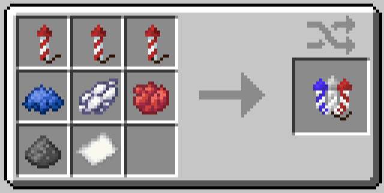

#  Independence Firework

🎆 Adds a single custom firework celebrating the United States' 250th birthday for the 4th of July!

## Recipe

## Questions

> **How do I install and use this datapack?**
> 
> Simply place the datapack zip file in the `datapacks` and `resourcepacks` folder of your world and reload both. You can also drag it into the data packs screen during world creation and resource packs screen, just make sure to enable it on the right side. Alternatively, you can use any global datapack loader mod or the mod packaged version!

> **Is the resource pack or anything client-side required?**
>
> Nope! The resource pack only gives the added firework a custom texture and all functionality is added server-side.

> **Will there be updates or additions to this pack?**
>
> I made this addition for fun to celebrate the holiday, while I do not have any plans to expand its content, I may revisit it in future years if interested!

## License

Feel free to play, stream, or showcase this pack so long as visible credit is given.  
This project can be packaged into any server or modpack so long as significant modifications are disclosed.  
Do **not** redistribute or reupload this pack or its source code without permission.  
Please link to one of the official pack pages instead of redistributing files.  

*Copyright © 2026 RoarkCats.*  
*All rights reserved.*  
